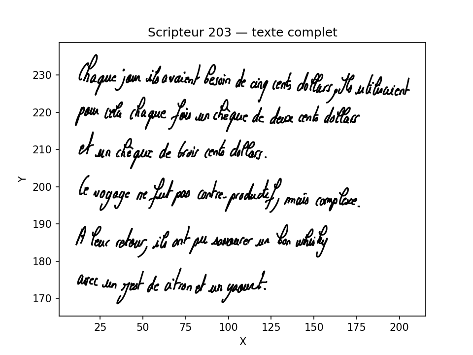
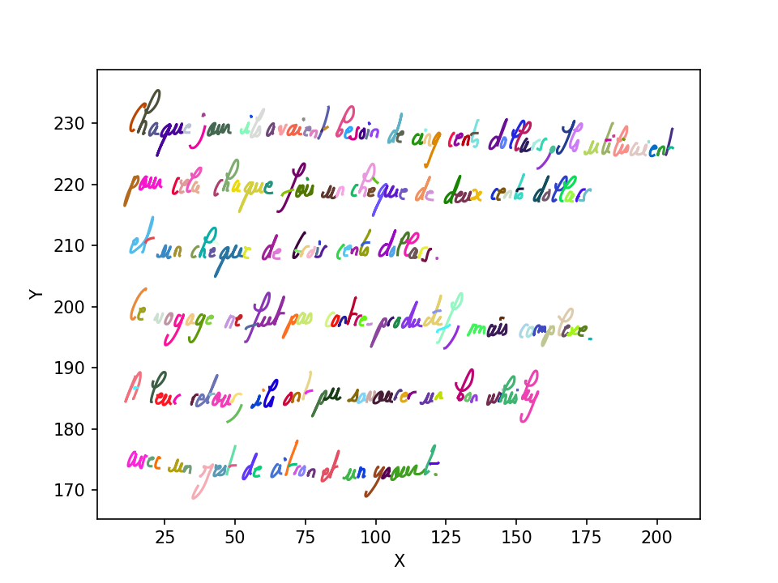

# Visualisation du texte manuscrit annoté

Ce dossier regroupe les scripts utilisés pour lire les fichiers JSON de tracé manuscrit (annotés au niveau du mot) et les afficher graphiquement, chaque mot dans une couleur distincte. C'est l'étape la plus en amont du projet : avant de segmenter automatiquement le texte, il fallait d'abord pouvoir **voir** ce que contenaient réellement les données.

## Contenu

| Script | Rôle |
|---|---|
| `JSON_show_first_stroke_of_txt.py` | Premier script écrit, sur un seul scripteur |
| `counter.py` | Comptage des mots/traits, comparaison de structures entre dossiers |
| `lire_le_dossier_JSON_automatiquement.py` | Comparaison et tracé sur les trois dossiers de données |
| `lire_tous_les_textes.py` | Version aboutie : un mot, une couleur |
| `tester_rangement.py` | Statistique du nombre de traits par mot |
| `tracer_parasites.py` | Inspection des traits marqués comme ponctuation |
| `tracer_txt.py` | Tracé d'un résultat déjà segmenté |

Le détail de chaque script (entrées, sorties, points critiques) est dans [`GUIDE.md`](./GUIDE.md).

## Aperçu

<p align="center">
  
  
</p>

À gauche : un texte manuscrit tracé en noir, sans distinction entre les mots. À droite : le même type de tracé, avec une couleur par mot annoté — c'est cette seconde version qui a permis, pour la première fois, de voir directement où le découpage en mots se situe dans les données brutes.

## Ce que ce dossier montre

**Une démarche itérative, pas un résultat figé du premier coup.** Le tout premier script (`JSON_show_first_stroke_of_txt.py`) contenait un bug de portée : `data[0]["Points"]` ne lisait que le premier trait du fichier, pas le texte entier. Ce bug, une fois identifié, a été corrigé dans les scripts suivants — la trace de cette évolution est volontairement conservée plutôt qu'effacée, voir [`GUIDE.md`](./GUIDE.md) pour le détail.

**Une vérification honnête plutôt qu'une hypothèse non testée.** `tracer_parasites.py` a permis de visualiser les segments filtrés comme « ponctuation » avant de les exclure du pipeline — et a révélé qu'ils ne sont pas concentrés à un seul endroit du texte, ce qui interroge sur ce que ce filtre écarte réellement.

## Dépendances

`json` (standard), `matplotlib`, `os`, `random`, `collections` (pour `counter.py`).

## Utilisation

Chaque script se lance indépendamment :

```bash
python3 lire_tous_les_textes.py
```

Certains scripts attendent un chemin relatif spécifique (`../json_bm/`, `../rangement/`) : voir [`GUIDE.md`](./GUIDE.md) pour l'organisation de dossiers attendue.
