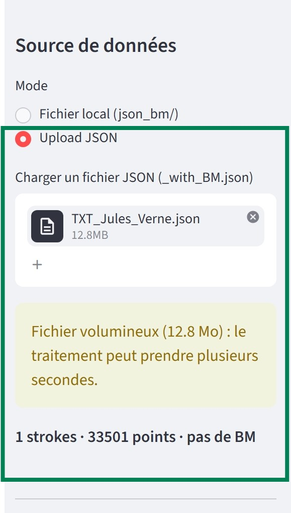
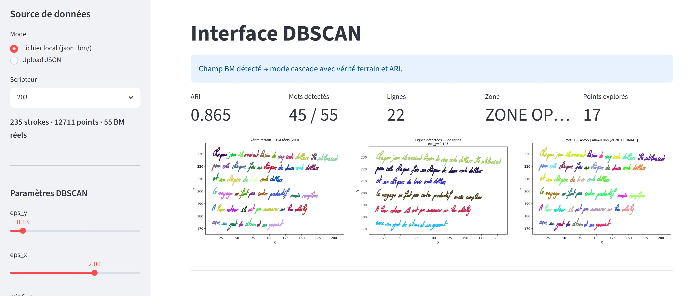
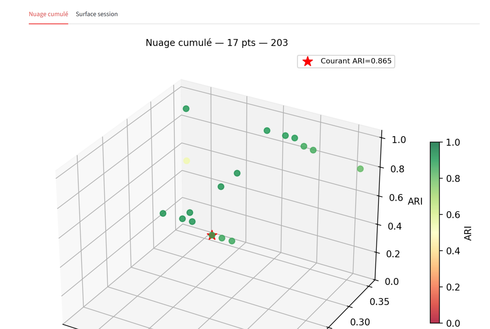

# Interface interactive de segmentation

Une interface Streamlit qui applique en temps réel la cascade DBSCAN sur un texte manuscrit, avec un retour visuel immédiat à chaque réglage. Contrairement aux scripts `grille_1d.py` et `grille_2d.py`, qui effectuent une recherche automatique par lot, cette interface est pensée pour un réglage manuel et exploratoire.

## Ce que fait l'interface

Un seul fichier, `interface_eps.py`, autonome. Elle détecte automatiquement si le fichier chargé contient une vérité terrain (champ `BM`) ou non, et adapte tout son comportement en conséquence :

- **Avec vérité terrain** : DBSCAN (lignes puis mots), score ARI, historique d'exploration en 3D.
- **Sans vérité terrain** : DBSCAN simple sur `(X, Y)`, résumé automatique du clustering, sans score puisqu'il n'y a rien à comparer.

## Charger un fichier

Deux sources sont proposées, choisies dans la barre latérale.

<p align="center">
  
  
</p>

À gauche : un fichier déjà rangé dans `json_bm/`, sélectionné dans un menu déroulant. À droite : un fichier déposé ponctuellement par upload l'interface prévient ici que le fichier est volumineux (12.8 Mo) et détecte l'absence de champ `BM`.

## Le résultat, mode avec vérité terrain

<p align="center">
  
</p>

Trois figures côte à côte (vérité terrain, lignes détectées, mots détectés), avec les indicateurs de qualité au-dessus : ARI, nombre de mots trouvés comparé au nombre réel, nombre de lignes, et une zone (sur-regroupement, zone optimale, sous-regroupement) qui donne un diagnostic immédiat sans avoir à interpréter le score seul.

## L'historique d'exploration en 3D

<p align="center">
  
</p>

Chaque réglage testé pendant la session est mémorisé et affiché comme un point dans cet espace `(eps_y, eps_x, ARI)`. Le point courant est marqué en rouge. Une case à cocher permet de basculer la couleur de l'ARI vers l'ordre chronologique d'exploration, pour voir comment la recherche a progressé dans le temps plutôt que juste où elle en est.

## Ce que ce dossier montre

**Un switch structurel, pas une simple option cosmétique.** Le comportement entier de l'interface (quatre curseurs contre un seul, présence ou non de l'ARI, historique 3D ou non) découle d'une seule variable calculée une fois à l'entrée. Documenté explicitement dans la cartouche du fichier comme le point de défaillance unique à vérifier en premier en cas de bug.

**Une robustesse pensée pour un usage réel, pas seulement pour le cas idéal.** Validation et réparation automatique des fichiers JSON tronqués, alerte sur les fichiers volumineux, détection avant écrasement d'un export existant, journal d'audit qui trace tous les exports sans jamais être écrasé.

**Une évolution motivée par des retours utilisateurs réels.** Plusieurs choix de conception (numérotation des groupes sur les figures, suppression d'un sélecteur redondant, disponibilité de l'export de vérité terrain limitée au bon mode) découlent directement de remarques faites en testant l'interface, pas de suppositions a priori.

## Dépendances

`streamlit`, `numpy`, `pandas`, `matplotlib`, `scikit-learn`.

## Utilisation

```bash
streamlit run interface_eps.py
```

Le guide développeur du dépôt détaille l'architecture complète (le switch, la cascade, la robustesse) avec un pseudo-code annoté pour chaque fonction.
